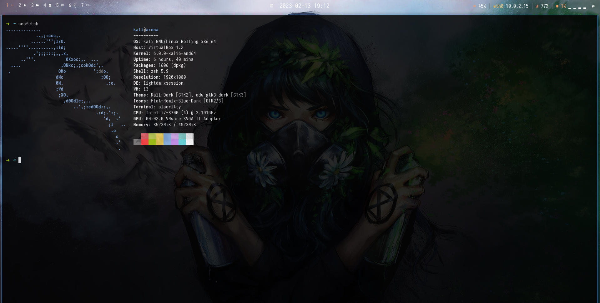
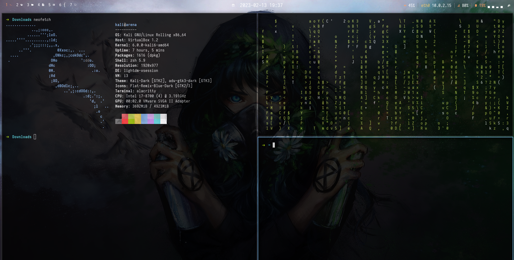

# MY KALI SETUP
- Dotfiles configuration
- it has been tested and run on kali linux

# About

The following are ones that might be involved in polybar or they have its configs

|Application|Configs/Included|
|-----------|-----------|
|WM|i3|
|Bar|polybar|
|Shell|zsh,bash|
|Terminal|tmux,gnome,alacrity|
|Editor|vim|
|File Manager|thunar,pcmanfm, nautilis|
|Launcher|dmenu,rofi,rofi-extended|
|Browser|firefox,firefox Developer Editor|
|Media|mpv,vlc|
|Compositor|compton|
|Note|obsidian|
|Code|visual studio code,Sublime|
|Wallpaper|feh|
|Virtualization|Virtualbox|
|Sec-Tools|burpsuite|


# Installation
The following commands can be used to setup your os

```
git clone https://github.com/blackninja23/dotfiles
cd dotfiles
chmod +x install.sh
./install.sh
```

# Screenshots



# References
[kali clean](https://github.com/xct/kali-clean)

[rofi custom](https://github.com/adi1090x/rofi)

[wallpapers](https://github.com/goatfiles/wallpapers)
